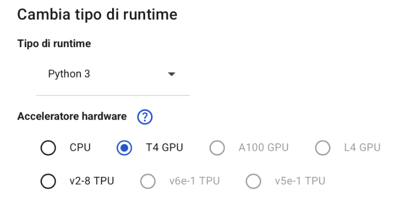
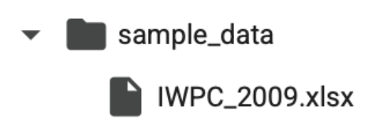

# 🧠 Privacy & Overfitting in Machine Learning  
## Membership & Attribute Inference Attack

Questo progetto analizza il fenomeno dell'**overfitting** e la sua correlazione con le vulnerabilità alla **Membership Inference Attack (MIA)** e **Attribute Inference Attack (AIA)**.  
Viene condotto un confronto tra modelli **overfit** e **regolarizzati**, utilizzando dataset **IWPC2009** (regressione) e **CIFAR-100** (classificazione), con implementazione di attacchi MIA e AIA.

---

## 🛠️ Requisiti

Tutto il progetto può essere eseguito direttamente su **Google Colab**, senza installazioni locali.

---

## ▶️ Come eseguire i notebook su **Google Colab**

### 🔹 1. Carica i file

Apri [Google Colab](https://colab.research.google.com/)

1. Clicca su **Nuovo Notebook**
2. Copiare i codici di questa repository all'interno della piattaforma

### 🔹 2. Carica il dataset IWPC_2009.xlsx
Nota bene: prima di eseguire il seguente codice è necessario:
– connettersi al runtime selezionando "Python 3" come tipo di runtime e "T4
GPU" come acceleratore hardware;

– caricare il dataset in formato "xlsx" direttamente all’interno del notebook
di Colab all’interno della cartella "sample_data" (situata nella sezione File);

### 🔹 3. Esegui il codice

- Premi **Shift + Invio** su ogni cella del notebook per eseguire il codice
- I grafici e i risultati appariranno direttamente in output (al di sotto del codice)

###📌 Ordine di esecuzione consigliato

- Per ogni notebook, segui questo ordine per una corretta esecuzione e comprensione dei risultati:
1. Training dei modelli (regressione e/o classificazione)
2. Membership Inference Attack (MIA)
3. Attribute Inference Attack (AIA)
